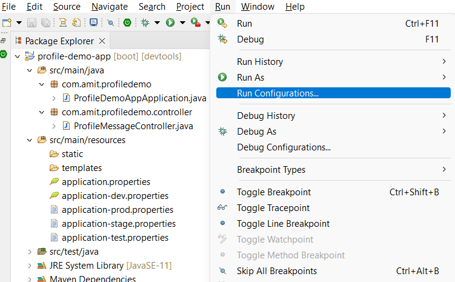
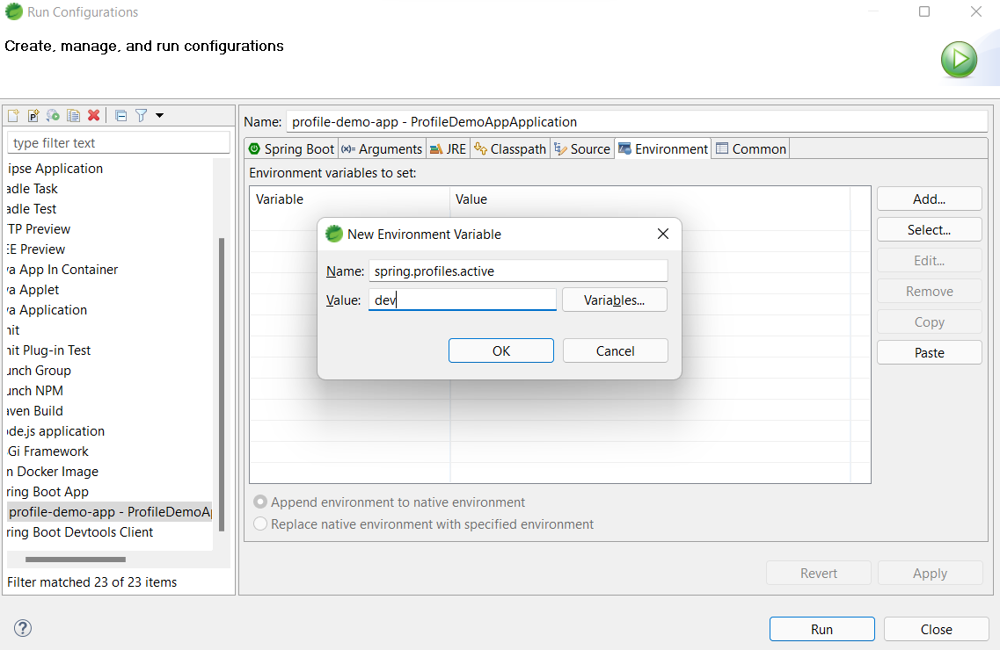
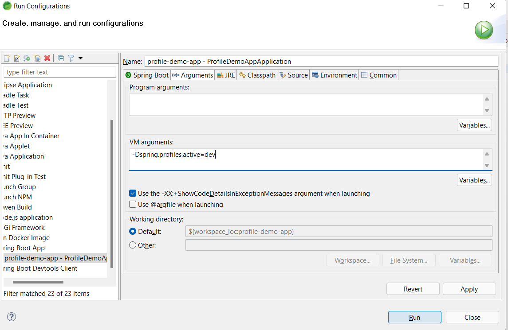
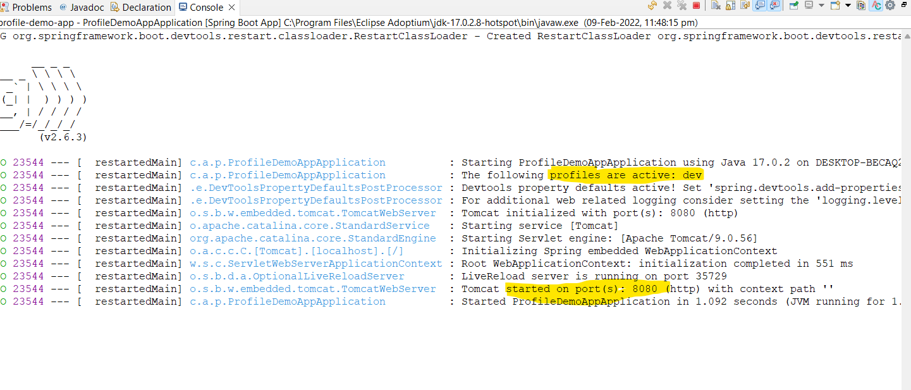
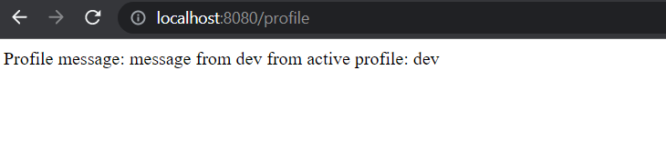

# profile-demo-app
Demo project for understanding Spring Boot profile

## To run specific profile in Spring Tool Suite follow below steps
1. *Open Run Configuration*     
    

2. *Add environment variable for profile*   
    

3. *Set profile in VM arguments*    
    

4. Run application and hit http://localhost:8080/profile in browser   
         
      
